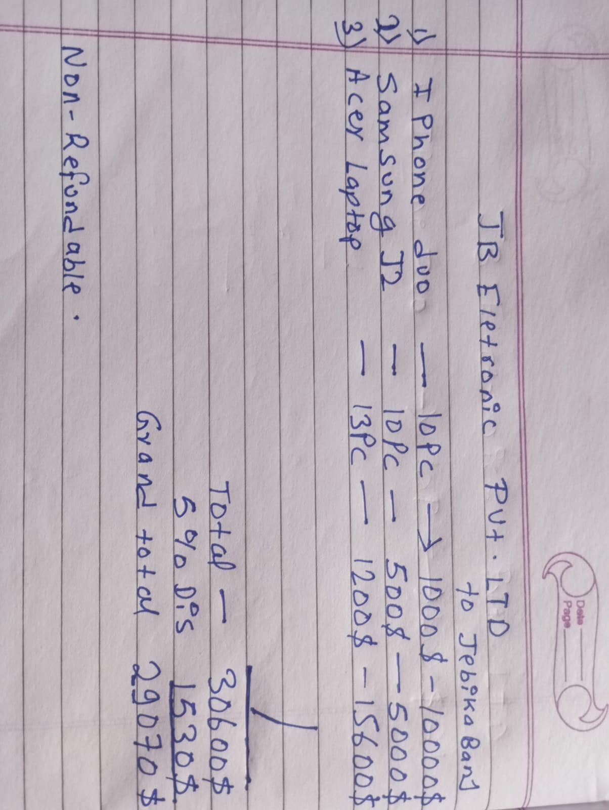
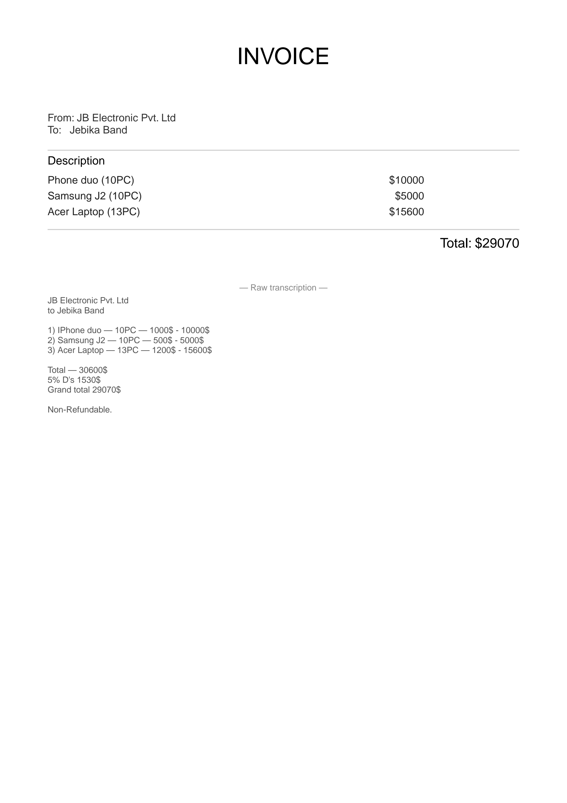

# SnapBill

> **Photograph a handwritten invoice. Get a clean PDF.**

SnapBill is a lightweight local AI application that converts a photo of a handwritten invoice into a clean, downloadable PDF. All OCR and text extraction happens on-device via [QVAC](https://qvac.tether.io/) — no cloud API, no API key, no upload.


to



---

## Features

- 📸 **Photo input** — take a picture or scan a handwritten invoice
- 🔍 **Local OCR** — extracts text via QVAC's LightOnOCR-2-1B vision model
- ✍️ **Editable transcription** — fix any OCR misreads before generating
- 📄 **PDF output** — clean, printable invoice with vendor, recipient, line items, and total
- 🔒 **Fully local** — the invoice image never leaves your machine

---

## Powered by QVAC

SnapBill uses [Tether's QVAC SDK](https://qvac.tether.io/) (`@qvac/sdk@^0.19.0`):

- `loadModel()` loads **LightOnOCR-2-1B** — a vision-language model trained for document and handwriting transcription
- `completion()` runs inference with the invoice image passed as a local file attachment
- The model is downloaded once from QVAC's peer-to-peer registry and cached at `~/.qvac/models/`

---

## Requirements

- **Node.js 22 or 24 LTS** (Node 26 currently has a known QVAC worker startup issue)
- **~1.5 GB free disk space** for the OCR model cache
- **~4 GB RAM** during inference
- **Vulkan 1.4+** on Windows (for the QVAC worker)
- Windows, macOS, or Linux

---

## Installation

```bash
git clone https://github.com/jodeepbanjade-source/snapbill.git
cd snapbill
npm install
```

---

## Model Setup

SnapBill uses **LightOnOCR-2-1B** (Q4_K_M quantization) plus its matching mmproj projection file (F16). The combined size is about **1.2 GB**.

The model is downloaded automatically on first run from QVAC's P2P registry and cached at `~/.qvac/models/`. No manual download is needed.

The exact constants used in `src/qvac.js`:

```js
import {
  OCR_0_6B_MULTIMODAL_Q4_K_M,
  MMPROJ_OCR_0_6B_MULTIMODAL_F16
} from '@qvac/sdk';
```

---

## Running

```bash
node server.js
```

Open **http://localhost:3000** in a browser.

1. Drop an invoice photo (JPG, PNG, or WebP)
2. Click **Transcribe Invoice**
3. Wait for the OCR to finish (see Performance below)
4. Edit the transcription if needed
5. Click **Download PDF**

---

## How It Works

```
Browser (upload)  ->  Local server  ->  sharp (downscale)
                          |
              QVAC loadModel() + completion()
                          |
              LightOnOCR-2-1B (on-device)
                          |
                  Text transcription
                          |
              Regex parsing -> structured fields
                          |
              PDFKit -> invoice.pdf
                          |
                    Browser download
```

1. Browser uploads the image to `POST /transcribe`
2. Server downscales it with `sharp` (max 800 px)
3. QVAC loads LightOnOCR and runs `completion()` with the image
4. The transcribed text is returned to the browser
5. User reviews/edits the text
6. User clicks "Download PDF" → server builds a PDF with PDFKit
7. Browser downloads the PDF

No network requests leave `localhost`.

---

## Privacy

- 🔒 **Your invoice is processed locally with QVAC**
- No cloud OCR API is used (no Google Vision, no AWS Textract, no OpenAI)
- No telemetry, no analytics
- The temp file is deleted after every request

The only network activity is the one-time model download from QVAC's peer-to-peer registry.

---

## Performance

Measured on an ordinary Windows laptop with Intel UHD integrated graphics:

| Scenario | Time |
|----------|------|
| Model load (cached on disk) | ~7 s |
| Image encoding | ~130 s |
| Text generation (116 tokens) | ~5 s |
| **Total per transcription** | **~2.3 minutes** |
| PDF generation | <1 s |

The image encoding dominates the runtime. On a laptop with a dedicated GPU, this drops to 15–30 seconds. On CPU-only machines, expect 3–5× slower than the numbers above.

The UI displays "this takes ~2–3 minutes on CPU" so users know to wait.

---

## Tech Stack

- **Frontend:** Plain HTML, CSS, JavaScript — no framework
- **Backend:** Node.js `http` module — no Express, no build step
- **AI:** `@qvac/sdk@^0.19.0`
- **Model:** LightOnOCR-2-1B (GGUF, Q4_K_M) + mmproj F16
- **Image processing:** `sharp` (downscaling)
- **PDF:** `pdfkit`

---

## Project Structure

```
snapbill/
├── docs/
│   ├── test-handwritten-invoice.jpeg
│   └── test-pdf-invoice.png
├── public/
│   ├── index.html
│   ├── app.js
│   └── styles.css
├── src/
│   ├── qvac.js         # QVAC wrapper
│   ├── parser.js       # Invoice field extraction
│   └── pdf.js          # PDF generation
├── server.js           # Local HTTP server
├── qvac.config.json    # QVAC config (rpcInitTimeoutMs, logging)
├── package.json
├── README.md
├── LICENSE
└── .gitignore
```

---

## QVAC Version

- `@qvac/sdk@^0.19.0` (tested with `0.19.1`)
- Uses `loadModel()` and `completion()`
- Vision inference via the `attachments` field in `history`

---

## License

MIT — see [LICENSE](./LICENSE).